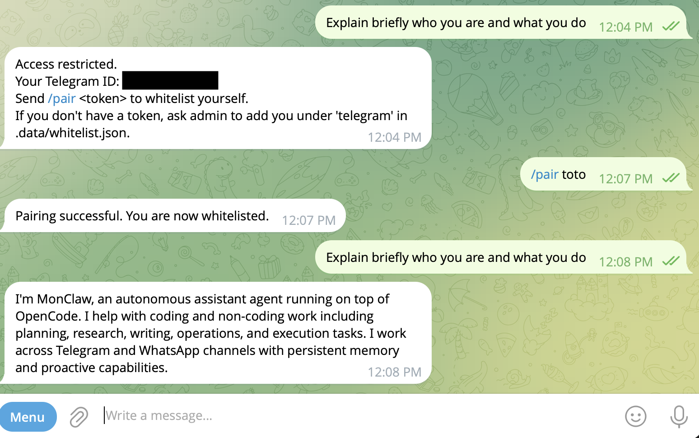

# OctoFlow



OctoFlow is a minimal implementation of an AI assistant using the OpenCode SDK.

- Telegram adapter (`grammy`)
- Single markdown memory file (`MEMORY.md`) loaded on every message
- Proactive memory updates via an OpenCode plugin tool (`save_memory`)
- Heartbeat task runner (periodic checklist from `heartbeat.md`)
- Channel-level whitelist with disk persistence

## Auth model (OpenCode-native)

This project is set up to reuse OpenCode's existing auth mechanisms.

- Default path: uses `createOpencode(...)` so SDK starts/manages a local OpenCode server and uses OpenCode auth/config.
- Alternate path: set `OPENCODE_SERVER_URL` to connect to an already-running OpenCode server/client setup.
- No app-specific API key is required in this repo.

## Quick start

1. Install Bun and dependencies:

```bash
# install bun
curl -fsSL https://bun.com/install | bash

# clone repo
git clone https://github.com/peerasak-u/OctoFlow.git && cd OctoFlow

# install
bun install
```

2. Log in using the OpenCode CLI:

```bash
bun run opencode auth login
```

Then open the TUI with `bun run opencode` and pick a model using `/models`.

3. Create the env file:

```bash
cp .env.example .env
```

4. Fill required values in `.env` (manually or via the setup script below):

- `TELEGRAM_BOT_TOKEN` (if Telegram enabled)

Optional:

- `OPENCODE_MODEL` in `provider/model` format
- `HEARTBEAT_INTERVAL_MINUTES` (default 30)
- `HEARTBEAT_FILE` (default `.data/heartbeat.md`; empty file disables heartbeat)
- `WHITELIST_FILE` (default `.data/whitelist.json`)
- `WHITELIST_PAIR_TOKEN` (required for self-pairing via chat command)

5. Run:

```bash
bun run dev
```

To keep it running after an SSH session ends:

```bash
nohup bun run dev > octoflow.log 2>&1 &
disown
```

## CLI onboarding

Run the interactive setup to configure channels and auth:

```bash
bun run setup
```

This will:
- Enable Telegram
- Capture bot token
- Update `.env`
- Check OpenCode model auth (launches `opencode` if missing)

## OpenCode E2E health check

Run a local end-to-end check that starts its own OpenCode server via SDK, sends a prompt, and verifies a model reply:

```bash
bun run test:opencode:e2e
```

## Commands

In Telegram chat:

- `/remember <text>`: force-save durable memory in `.data/workspace/MEMORY.md`
- `/pair <token>`: add your account to whitelist (if pairing token is configured)
- `/new`: start a new shared main OpenCode session across all channels
- Any normal message: sent to OpenCode SDK session, with relevant memory context injected

## Data layout

- `.data/sessions.json`: shared `mainSessionID` + separate `heartbeatSessionID`
- `.data/workspace/MEMORY.md`: durable user memory (single memory file)
- `.data/whitelist.json`: allowed Telegram accounts

## Security

- Warning: This project is experimental. Use at your own risk and exercise extreme care and caution, especially in production or with sensitive data.
